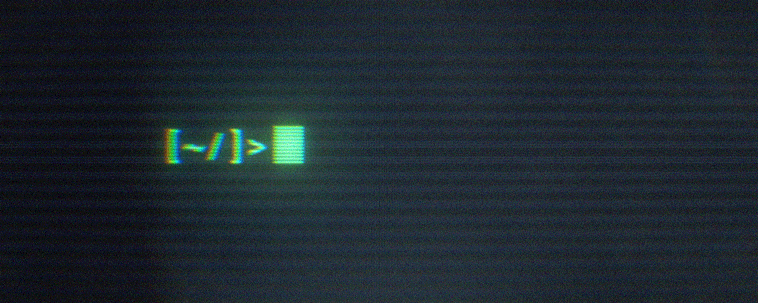
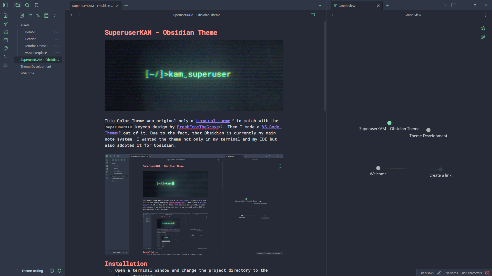
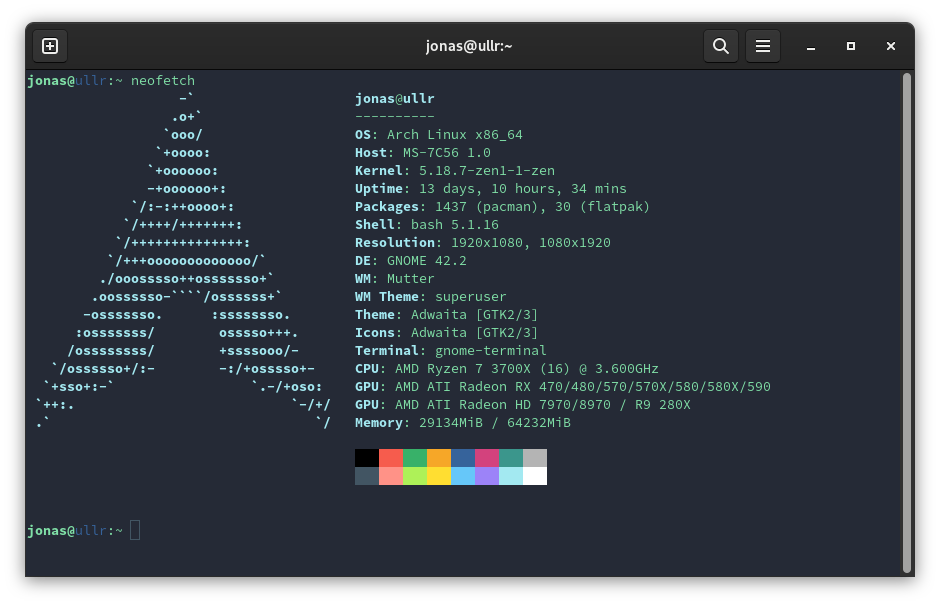
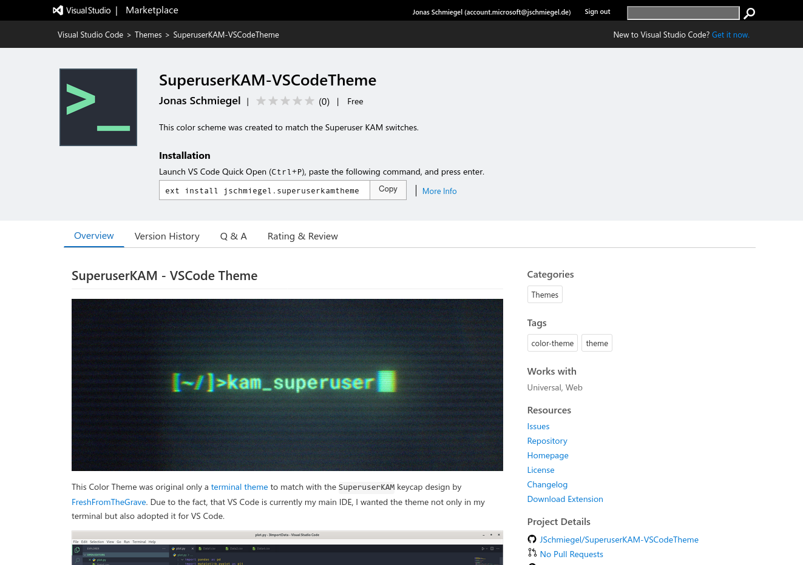

# SuperuserKAM - Obsidian Theme


This Color Theme was original only a [terminal theme](https://github.com/JSchmiegel/ColorSchemeSuperuserKAM) to match with the `SuperuserKAM` keycap design by [FreshFromTheGrave](https://geekhack.org/index.php?topic=108326.0%3Futm_source%3Dkeycapsets). Then I made a [VS Code Theme](https://github.com/JSchmiegel/SuperuserKAM-VSCodeTheme) out of it. Due to the fact, that Obsidian is currently my main note system, I wanted the theme not only in my terminal and my IDE but also adopted it for Obsidian.


## Installation
1. Open a terminal window and change the project directory to the `themes` directory.
    ```bash
    cd path/to/vault/.obsidian/themes
    ```
2. Clone the sample theme using Git.
    ```bash
    git clone https://github.com/obsidianmd/obsidian-sample-theme.git "SuperuserKAM-ObsidianTheme"
    ```
3. Enable the theme by opening **Settings** in Obsidian. Then go to **Appearance**. Next to **Themes**, select **SuperuperKAM-ObsidianTheme** from the dropdown list. 


## Terminal Theme
If you are excited about the theme, you can find a terminal theme for [iTerm2](https://github.com/JSchmiegel/SuperuserKAM-TerminalTheme/wiki/Installation-Guide:-iTerm2), [Windows Terminal](https://github.com/JSchmiegel/SuperuserKAM-TerminalTheme/wiki/Installation-Guide:-Windows-Terminal) and [Gnome Terminal](https://github.com/JSchmiegel/SuperuserKAM-TerminalTheme/wiki/Installation-Guide:-Gnome-Terminal) in the following repository: [SuperuserKAM-TerminalTheme](https://github.com/JSchmiegel/ColorSchemeSuperuserKAM)



## VS Code Theme
You can easily find the theme on the [marketplace for VS Code extensions](https://marketplace.visualstudio.com/items?itemName=jschmiegel.superuserkamtheme).



## Open for suggestions and improvements
If you have any suggestions for improvements I am open for any pull requests.